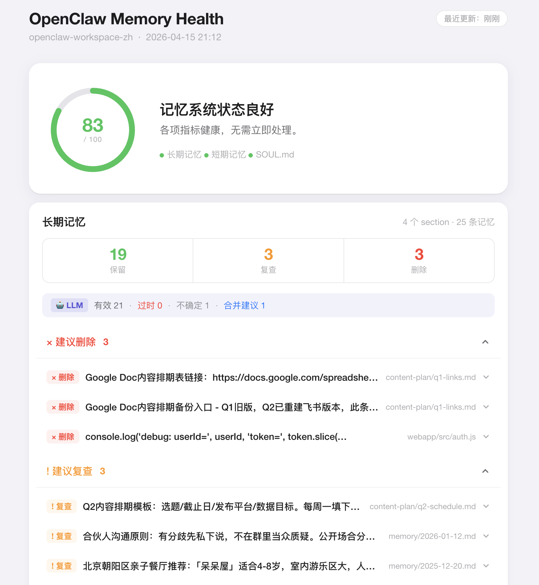
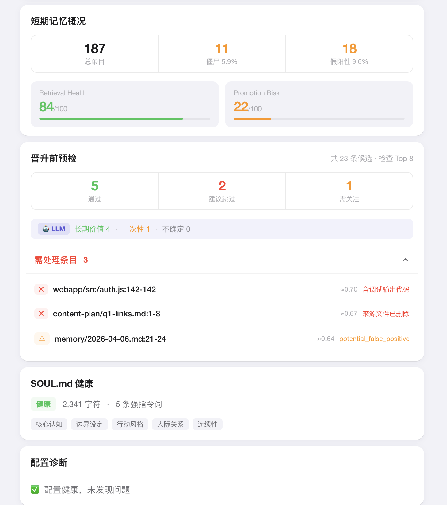
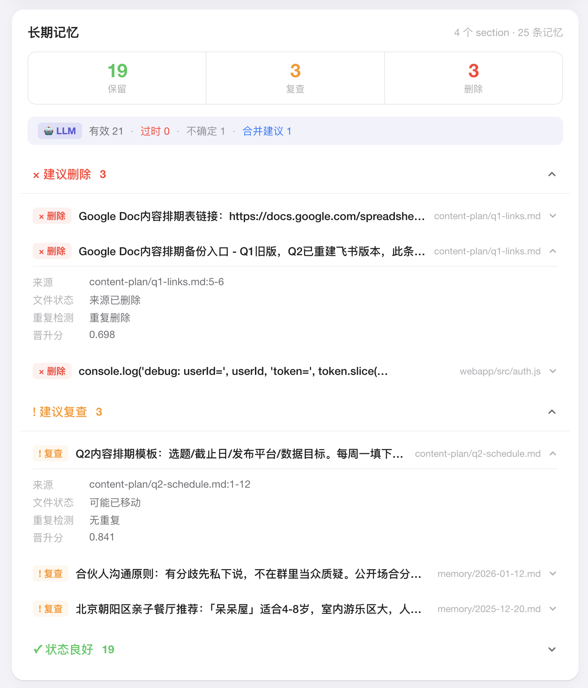
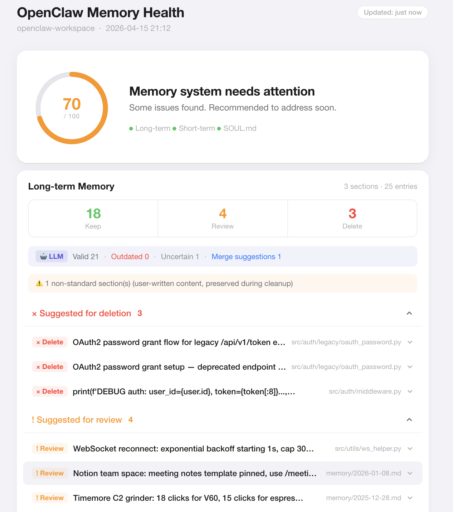
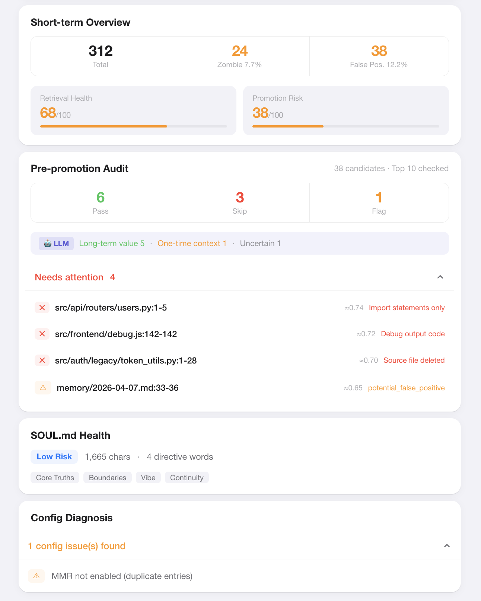
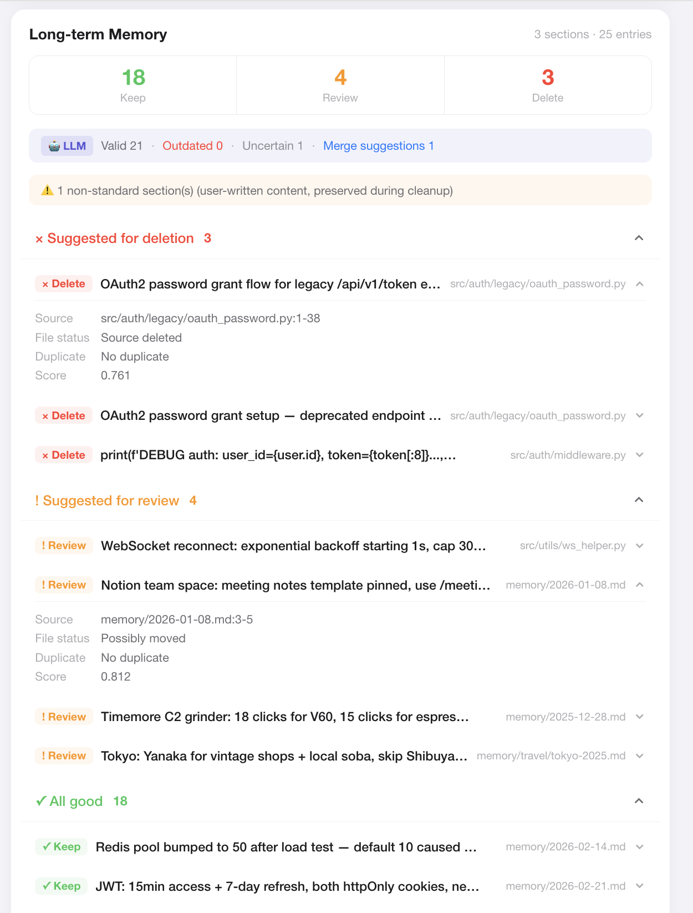

# openclaw-memhealth

**OpenClaw 记忆系统的外部 QA 层 —— 诊断、守护、清理你的 AI 记忆。**

[English](#english) · [报告问题](https://github.com/ladyiceberg/openclaw-memory-quality/issues/new?template=bug_report.md) · [功能建议](https://github.com/ladyiceberg/openclaw-memory-quality/issues/new?template=feature_request.md)

---

OpenClaw 会随着你的使用自动积累记忆——短期 recall 信号、晋升到 `MEMORY.md` 的长期记忆、以及定义 AI 人格的 `SOUL.md`。时间一长，这套系统会悄悄出问题：

- **长期记忆过时**：MEMORY.md 里的代码片段指向已删除或大幅重构的文件，AI 仍然当成事实引用
- **短期记忆污染**：FTS 字面匹配产生大量假阳性条目，被误判为高频高价值内容晋升
- **SOUL.md 漂移**：任务指令、业务规则悄悄混入 AI 的身份文件，改变 AI 的基本行为
- **只增不减**：OpenClaw 只往记忆里写，没有清理机制

**openclaw-memhealth** 是一个独立的 MCP Server，作为外部 QA 层挂在你现有的 OpenClaw 旁边，不占插件位。它通过分析检索行为数据（不只是内容本身）来诊断你的记忆系统是否在产生噪音。

---

## 三层架构

```
第一层：观察 Observe   — 诊断记忆健康状态（只读，零风险）
第二层：守护 Guard     — 在内容晋升进 MEMORY.md 之前拦截低质量候选
第三层：清理 Remediate — 安全清理已污染的长期记忆
```

---

## 环境要求

- **OpenClaw**（任何近期版本）
- **Python 3.11+**
- **LLM API Key**（可选，用于语义评估功能）
  - 支持 OpenAI、Anthropic、Kimi、MiniMax

---

## 安装

```bash
pip install openclaw-memory-quality
```

---

## MCP 工具列表

### 第一层 — 观察（只读）

| 工具 | 功能 |
|------|------|
| `memory_health_check_oc()` | 快速健康扫描：僵尸条目数、假阳性率、三项诊断评分 |
| `memory_retrieval_diagnose_oc()` | 检索质量深度诊断：高频低质条目、配置建议 |
| `memory_longterm_audit_oc()` | `MEMORY.md` 深度审计：来源有效性、重复检测、生成 `report_id` |

### 第二层 — 守护

| 工具 | 功能 |
|------|------|
| `memory_promotion_audit_oc()` | 晋升前预检：5 道质量关卡 + LLM 长期价值评估 |
| `memory_config_doctor_oc()` | 从行为数据推断 embedding/minScore 配置问题 |
| `memory_soul_check_oc()` | 审计 `SOUL.md`：边界违规、身份漂移、稳定性检查 |

### 第三层 — LLM 语义层

| 工具 | 功能 |
|------|------|
| `memory_longterm_audit_oc(use_llm=True)` | 语义有效性审查 + 合并建议 |
| `memory_soul_check_oc(use_llm=True)` | 人格 vs. 任务指令分类、内部矛盾检测 |
| `memory_longterm_cleanup_oc(report_id)` | 安全重写 `MEMORY.md`：原子写入、自动备份、并发锁保护 |

---

## Skills（斜杠命令）

安装后，以下斜杠命令可在 OpenClaw 对话中直接使用：

| 命令 | 功能 |
|------|------|
| `/memory-check` | 运行全套健康检查，打开可视化看板 |
| `/memory-cleanup` | 清理长期记忆中的过期条目 |
| `/memory-diagnose` | 检索质量深度诊断 |
| `/memory-promote` | 晋升前预检，防止低质量内容进入长期记忆 |
| `/soul-check` | SOUL.md 完整性审计 |

---

## 工作原理

OpenClaw 的记忆流水线存在结构性弱点：

```
检索噪音（minScore=0.35 默认值 + FTS 字面匹配）
    ↓ 产生
短期假阳性（高频低质量条目）
    ↓ 通过
晋升误判（频率权重忽略了命中质量）
    ↓ 污染
MEMORY.md（只增不减，没有清理机制）
    ↓ 导致
AI 长期行为漂移
```

openclaw-memhealth 在这条链路的每个环节介入——从 `queryHashes` 和 `avgScore` 信号诊断检索质量，将长期记忆与当前源文件比对验证，并检查 `SOUL.md` 中不该出现的内容。

---

## 与 memory-quality-mcp 的关系

[memory-quality-mcp](https://github.com/ladyiceberg/memory-quality-mcp) 管理 **Claude Code** 的记忆质量。
**openclaw-memhealth** 管理 **OpenClaw** 的记忆质量。

两者同属 **memhealth** 产品线——相同的思路，不同的生态。同时使用 Claude Code 和 OpenClaw 的用户可以并行部署两个工具。

---

## 效果预览







---

## License

MIT — 详见 [LICENSE](LICENSE)

---

<a name="english"></a>

# openclaw-memhealth

**External QA layer for OpenClaw memory — diagnose, guard, and remediate your agent's memory.**

[中文](#openclaw-memhealth) · [Report a Bug](https://github.com/ladyiceberg/openclaw-memory-quality/issues/new?template=bug_report.md) · [Request a Feature](https://github.com/ladyiceberg/openclaw-memory-quality/issues/new?template=feature_request.md)

---

OpenClaw automatically builds a memory system as your agent works — storing short-term recall signals, promoting them into `MEMORY.md`, and loading `SOUL.md` on every session. Over time, this memory accumulates problems that silently degrade your agent's behavior:

- **Stale long-term memories** — code snippets pointing to deleted or heavily refactored files, still cited as facts
- **False-positive short-term entries** — low-quality FTS hits that inflate recall counts and get promoted
- **SOUL.md drift** — task instructions and business rules creeping into your agent's identity file
- **No cleanup mechanism** — OpenClaw only adds to memory, never removes

**openclaw-memhealth** is a standalone MCP Server that sits alongside your existing OpenClaw setup without occupying a plugin slot. It uses retrieval behavior data — not just content — to diagnose whether your memory system is producing noise.

---

## Three-layer architecture

```
Layer 1: Observe   — diagnose memory health (read-only, zero risk)
Layer 2: Guard     — audit promotion candidates before they enter MEMORY.md
Layer 3: Remediate — safely clean up polluted long-term memory
```

---

## Requirements

- **OpenClaw** (any recent version)
- **Python 3.11+**
- **LLM API Key** (optional — for semantic evaluation features)
  - OpenAI, Anthropic, Kimi, or MiniMax

---

## Installation

```bash
pip install openclaw-memory-quality
```

---

## MCP Tools

### Layer 1 — Observe (read-only)

| Tool | Description |
|------|-------------|
| `memory_health_check_oc()` | Quick health scan — zombie count, false-positive rate, three diagnostic scores |
| `memory_retrieval_diagnose_oc()` | Detailed retrieval quality diagnosis — high-freq low-quality entries, config suggestions |
| `memory_longterm_audit_oc()` | Deep audit of `MEMORY.md` — source validity, duplicate detection, generates `report_id` |

### Layer 2 — Guard

| Tool | Description |
|------|-------------|
| `memory_promotion_audit_oc()` | Pre-promotion quality check — 5 gates + LLM long-term value assessment |
| `memory_config_doctor_oc()` | Infer embedding/minScore configuration issues from behavior data |
| `memory_soul_check_oc()` | Audit `SOUL.md` for boundary violations, identity drift, and stability |

### Layer 3 — LLM Semantic Layer

| Tool | Description |
|------|-------------|
| `memory_longterm_audit_oc(use_llm=True)` | Semantic validity review + merge suggestions |
| `memory_soul_check_oc(use_llm=True)` | Persona vs. task-instruction classification, contradiction detection |
| `memory_longterm_cleanup_oc(report_id)` | Safely rewrite `MEMORY.md` — atomic write, backup, concurrency guard |

---

## Skills (slash commands)

Once installed, these slash commands are available in your OpenClaw conversations:

| Command | Description |
|---------|-------------|
| `/memory-check` | Run full health check and open the visual dashboard |
| `/memory-cleanup` | Clean up stale entries in long-term memory |
| `/memory-diagnose` | Deep retrieval quality diagnosis |
| `/memory-promote` | Pre-promotion audit to prevent low-quality content from entering long-term memory |
| `/soul-check` | Full SOUL.md integrity audit |

---

## How it works

OpenClaw's memory pipeline has a structural weakness:

```
Retrieval noise (minScore=0.35 default + FTS literal matching)
    ↓ produces
Short-term false positives (high-frequency low-quality entries)
    ↓ via
Promotion miscalculation (frequency component ignores hit quality)
    ↓ pollutes
MEMORY.md (append-only, no cleanup mechanism)
    ↓ causes
Long-term agent behavior drift
```

openclaw-memhealth intercepts this chain at every stage — diagnosing retrieval quality from `queryHashes` and `avgScore` signals, auditing long-term memory against current source files, and checking `SOUL.md` for content that doesn't belong in an identity file.

---

## Relationship to memory-quality-mcp

[memory-quality-mcp](https://github.com/ladyiceberg/memory-quality-mcp) handles **Claude Code** memory quality.
**openclaw-memhealth** handles **OpenClaw** memory quality.

Both tools are part of the **memhealth** product line — same approach, different ecosystems. Power users running both Claude Code and OpenClaw can use both tools side by side.

---

## Dashboard Preview







---

## License

MIT — see [LICENSE](LICENSE)
